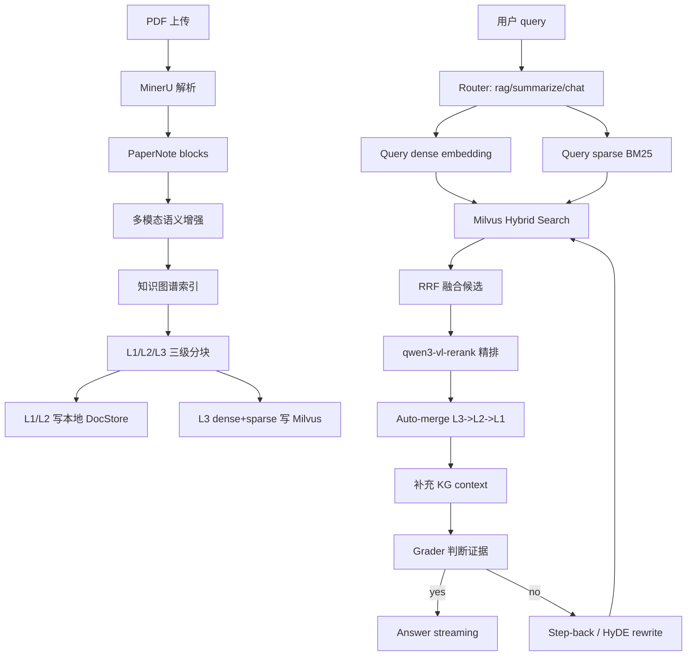

# PaperNote

PaperNote 是一个面向科研论文阅读的轻量级 AI 辅助系统。项目目标不是只做 PDF 预览或普通聊天，而是把论文 PDF 解析成可检索、可引用、可追踪的多模态知识库，并在此基础上提供 Agentic RAG 问答、图表理解、划线高亮、笔记和翻译能力。

当前项目采用前后端分离架构：

- 前端：React + Vite + TypeScript，负责 PDF 阅读、聊天面板、RAG 过程可视化、标注和翻译交互。
- 后端：FastAPI + LangGraph + MinerU + Milvus Lite，负责论文解析、索引、Agentic RAG、多轮对话和数据持久化。
- 大模型：默认通过 OpenAI-compatible 接口接入 Qwen，可切换 OpenAI、Kimi、Gemini 等 provider。
- 向量检索：Milvus Hybrid Search，dense 使用 Qwen `text-embedding-v4`，sparse 使用本地 BM25。
- 精排：默认接入阿里云 DashScope `qwen3-vl-rerank`。

## 核心能力

- PDF 上传、解析和状态轮询。
- MinerU 解析论文文本、图片、表格、公式和版面结构。
- 本地 fallback parser，MinerU 不可用或下载失败时仍可降级解析。
- 自动提取论文标题，而不是只展示文件名。
- 科研论文复合 Figure 裁剪和 caption 对齐。
- 图片、表格、公式的多模态语义增强。
- 轻量级多模态知识图谱索引。
- Agentic RAG 多轮问答，包括路由、检索、证据评分、问题重写、精排、父块合并和流式回答。
- Milvus dense+sparse hybrid retrieval。
- qwen3-vl-rerank 精排。
- SSE 流式输出和前端打字机效果。
- RAG 检索过程可视化。
- 多轮会话落库。
- PDF 选中文本后翻译、划线高亮、添加笔记。
- 历史论文和历史会话加载。

## 技术栈

### 后端

| 模块 | 技术 |
|---|---|
| Web 框架 | FastAPI |
| 异步服务 | Uvicorn |
| Agent 编排 | LangGraph |
| LLM 接入 | LangChain + langchain-openai |
| PDF 解析 | MinerU API v4 |
| PDF fallback | PyMuPDF |
| 向量数据库 | Milvus Lite / pymilvus |
| Dense embedding | Qwen `text-embedding-v4` |
| Sparse retrieval | 本地 BM25SparseEncoder |
| Rerank | DashScope `qwen3-vl-rerank` |
| 数据库 | SQLite + aiosqlite |
| 流式输出 | SSE / sse-starlette |

### 前端

| 模块 | 技术 |
|---|---|
| 框架 | React 18 |
| 构建工具 | Vite |
| 类型系统 | TypeScript |
| PDF 阅读 | react-pdf |
| Markdown 渲染 | react-markdown |
| 数学公式 | KaTeX |
| 布局 | react-resizable-panels |
| 图标 | lucide-react |
| 样式 | Tailwind CSS + 自定义 CSS |

## 目录结构

```text
PaperNote/
├── backend/
│   ├── app/
│   │   ├── agents/                  # LangGraph Agentic RAG 节点
│   │   ├── api/                     # papers/chat/settings/annotations API
│   │   ├── core/                    # 配置和 SQLite 初始化
│   │   ├── services/                # MinerU、Milvus、KG、多模态增强、LLM
│   │   └── data/                    # 本地上传文件、Milvus Lite、SQLite 数据
│   ├── tests/                       # 最小回归测试
│   ├── requirements.txt
│   └── .env.example
├── frontend/
│   ├── src/
│   │   ├── components/
│   │   │   ├── chat/                # 聊天、RAG trace、标注列表
│   │   │   ├── layout/              # 上传和历史侧栏
│   │   │   ├── pdf/                 # PDF 阅读器和选区弹窗
│   │   │   └── settings/            # 模型设置弹窗
│   │   ├── api.ts
│   │   └── App.tsx
│   └── package.json
├── docs/
│   └── agentic_rag_query_walkthrough.md
└── README.md
```

说明：`backend/app/data` 和 `docs` 当前在 `.gitignore` 中，主要用于本地运行产物和调试文档。

## 快速开始

### 1. 后端环境

建议使用已有 conda 环境 `paper-note`：

```bash
conda activate paper-note
cd /Users/marc/code_projects/PaperNote/backend
pip install -r requirements.txt
```

如果重新创建环境：

```bash
conda create -n paper-note python=3.13
conda activate paper-note
cd /Users/marc/code_projects/PaperNote/backend
pip install -r requirements.txt
```

### 2. 配置后端环境变量

复制示例配置：

```bash
cd /Users/marc/code_projects/PaperNote/backend
cp .env.example .env
```

最小可用配置建议：

```env
LLM_PROVIDER=qwen
QWEN_API_KEY=你的阿里云百炼或 DashScope Key
QWEN_BASE_URL=https://dashscope.aliyuncs.com/compatible-mode/v1

EMBEDDING_PROVIDER=qwen
EMBEDDING_MODEL=text-embedding-v4

RERANK_MODEL=qwen3-vl-rerank
RERANK_BINDING_HOST=https://dashscope.aliyuncs.com/api/v1/services/rerank/text-rerank/text-rerank
RERANK_API_KEY=${QWEN_API_KEY}

MINERU_API_KEY=你的 MinerU API Key
MINERU_MODEL_VERSION=vlm
MINERU_LANGUAGE=ch
```

`MINERU_API_KEY` 为空时，系统会使用本地 PyMuPDF fallback parser。fallback 可以保证基本文本阅读和问答，但图片、表格、公式解析质量会低于 MinerU。

### 3. 启动后端

```bash
cd /Users/marc/code_projects/PaperNote/backend
conda activate paper-note
uvicorn app.main:app --reload --host 127.0.0.1 --port 8000
```

健康检查：

```bash
curl http://127.0.0.1:8000/api/health
```

### 4. 启动前端

```bash
cd /Users/marc/code_projects/PaperNote/frontend
corepack pnpm install
corepack pnpm dev
```

默认访问：

```text
http://127.0.0.1:5173
```

## 环境变量说明

### LLM

| 变量 | 说明 |
|---|---|
| `LLM_PROVIDER` | 当前聊天和 Agent 使用的模型提供商，支持 `qwen`、`openai`、`kimi`、`gemini` 等 |
| `LLM_MODEL` | 聊天模型名称。为空时，`qwen` 默认使用 `qwen-max` |
| `QWEN_API_KEY` | Qwen/DashScope API Key |
| `QWEN_BASE_URL` | Qwen OpenAI-compatible endpoint，默认 `https://dashscope.aliyuncs.com/compatible-mode/v1` |

### Embedding

| 变量 | 说明 |
|---|---|
| `EMBEDDING_PROVIDER` | dense embedding provider，默认 `qwen` |
| `EMBEDDING_MODEL` | dense embedding 模型，默认 `text-embedding-v4` |
| `EMBEDDING_API_KEY` | 可选。为空时复用 provider 对应 key，例如 `QWEN_API_KEY` |
| `EMBEDDING_BASE_URL` | 可选。为空时复用 provider 对应 base url |
| `DENSE_EMBEDDING_DIM` | dense 向量维度，当前为 `1024` |

### Milvus

| 变量 | 说明 |
|---|---|
| `MILVUS_URI` | Milvus Lite 文件路径或独立 Milvus URI。为空时使用 `backend/app/data/milvus/papernote.db` |
| `MILVUS_COLLECTION` | 旧版 block collection 前缀，默认 `papernote_blocks` |
| `AGENTIC_MILVUS_COLLECTION_PREFIX` | Agentic RAG collection 前缀，默认 `papernote_agentic_blocks` |
| `MILVUS_GRPC_KEEPALIVE_TIME_MS` | gRPC keepalive 时间，默认 `120000` |
| `MILVUS_GRPC_KEEPALIVE_TIMEOUT_MS` | gRPC keepalive timeout，默认 `20000` |
| `MILVUS_GRPC_KEEPALIVE_PERMIT_WITHOUT_CALLS` | 是否允许无调用 keepalive，默认 `false` |

### Agentic RAG

| 变量 | 默认值 | 说明 |
|---|---:|---|
| `AGENTIC_RAG_ENABLED` | `true` | 是否启用 Agentic RAG |
| `BM25_STATE_PATH` | 空 | 本地 BM25 统计持久化路径，空时使用 `backend/app/data/bm25_state.json` |
| `AUTO_MERGE_ENABLED` | `true` | 是否启用父块合并 |
| `AUTO_MERGE_THRESHOLD` | `2` | 同父块命中数量达到该阈值时合并父块 |
| `LEAF_RETRIEVE_LEVEL` | `3` | Milvus 只检索哪个层级，当前为 L3 |
| `AGENTIC_CANDIDATE_MULTIPLIER` | `3` | 初召回候选倍数，`top_k=6` 时候选池为 `18` |
| `RAG_GRADE_MODEL` | 空 | 证据评分模型。为空时复用 `LLM_MODEL` 或 provider 默认模型 |
| `RAG_MAX_REWRITES` | `1` | 证据不足时最多重写检索几轮 |
| `CONVERSATION_SUMMARY_TRIGGER_MESSAGES` | `12` | 预留的会话摘要触发阈值 |

### Rerank

| 变量 | 说明 |
|---|---|
| `RERANK_MODEL` | 默认 `qwen3-vl-rerank` |
| `RERANK_BINDING_HOST` | DashScope rerank endpoint |
| `RERANK_API_KEY` | rerank key，通常可复用 `${QWEN_API_KEY}` |

Rerank 是可选增强。任意一个 rerank 变量为空时，系统会跳过 rerank，基础 RAG 仍可运行。

### MinerU 和多模态

| 变量 | 默认值 | 说明 |
|---|---:|---|
| `MINERU_API_KEY` | 空 | MinerU API Key |
| `MINERU_MODEL_VERSION` | `vlm` | MinerU 模型版本 |
| `MINERU_LANGUAGE` | `ch` | MinerU 解析语言 |
| `ENABLE_MINERU_FIGURE_CROPS` | `true` | 是否启用论文正文 Figure 裁剪 |
| `DELETE_MINERU_RAW_IMAGES_AFTER_FIGURE_CROPS` | `true` | 合并 Figure 后是否删除原始 parsed/images，节省空间 |
| `FIGURE_CROP_DPI` | `220` | Figure 裁剪 DPI |
| `FIGURE_CROP_PADDING` | `0.012` | Figure 裁剪边距 |
| `ENABLE_MULTIMODAL_ANSWERS` | `true` | 回答时是否向多模态模型传图片证据 |
| `MULTIMODAL_ANSWER_IMAGE_LIMIT` | `4` | 单次回答最多传入多少张图片 |
| `ENABLE_MULTIMODAL_ENRICHMENT` | `true` | 索引时是否生成图片/表格/公式语义元数据 |
| `MULTIMODAL_ENRICHMENT_LLM_LIMIT` | `8` | 索引时最多调用多少个多模态 block 的 LLM/VLM 增强 |

## 后端技术路线

### 1. 上传与解析

用户上传 PDF 后，后端执行：

```text
POST /api/papers/upload
-> 保存 PDF 到 backend/app/data/uploads/{paper_id}/
-> 后台任务 _process_paper()
-> MinerU parse_pdf()
-> 自动提取论文标题
-> vector_store.index_paper()
-> 生成 overview、keywords
-> papers.status = ready
```

MinerU API v4 流程：

```text
POST /api/v4/file-urls/batch
-> PUT 上传 PDF 到返回的 upload_url
-> GET /api/v4/extract-results/batch/{batch_id}
-> 下载 full_zip_url
-> 解压 content_list、model.json、full.md、图片资源
```

如果 MinerU 没有配置、上传失败、轮询失败或 ZIP 下载失败，系统会降级到本地 PyMuPDF fallback parser。这样可以保证应用可用，但多模态结构会变弱。

### 2. 论文 block 构建

MinerU 的 `content_list` 会被转换为 PaperNote blocks：

- `text`
- `image`
- `table`
- `equation`
- `generic`

对于长文本，旧版 block 构建阶段会先做一次基础切分：

```text
BLOCK_CHAR_LIMIT = 1200
BLOCK_CHAR_OVERLAP = 180
```

这些 blocks 会写入 `index_manifest.json`，作为后续 Agentic RAG、知识图谱和 fallback 检索的共同基础。

### 3. 多模态语义增强

图片、表格、公式 block 会进入 `multimodal_enricher`：

```text
caption
nearby context
body / latex / table body
asset path
-> heuristic metadata
-> optional LLM/VLM metadata
-> semantic_summary
-> semantic_metadata
```

如果没有可用 LLM/VLM key，也不会中断索引。系统会使用 caption、正文上下文、表格内容或公式文本做启发式摘要。

### 4. 多模态知识图谱

`knowledge_graph_indexer` 会为每篇论文生成本地 JSON 图谱：

```text
paper node
section node
block node
concept node
modality relation
page relation
section relation
concept relation
```

图谱文件位置：

```text
backend/app/data/uploads/{paper_id}/parsed/knowledge_graph.json
```

检索结束后，系统会对最终 sources 调用 `context_for_blocks()`，把同页图片、同 section、相关概念等信息补充到 prompt 中。

## Agentic RAG 检索链路

当前问答默认走 `app.agents.agentic_rag` 中的 LangGraph：

```text
router
-> retrieve_initial
-> grade_documents
-> answer_agentic
```

如果证据不足：

```text
router
-> retrieve_initial
-> grade_documents
-> rewrite_question
-> retrieve_expanded
-> answer_agentic
```

### 1. 三级分块

Agentic RAG 会对每个 PaperNote block 再做三级滑动窗口切分：

| 层级 | chunk 大小 | overlap | 作用 |
|---|---:|---:|---|
| L1 | 2600 字符 | 320 字符 | 大父块，只存本地 JSON DocStore |
| L2 | 1300 字符 | 180 字符 | 中父块，只存本地 JSON DocStore |
| L3 | 650 字符 | 90 字符 | 叶子块，写入 Milvus 做检索 |

切分时会尽量在换行、中文句号、英文句号和空格处断开，避免直接切断句子。

产物：

```text
backend/app/data/uploads/{paper_id}/parsed/agentic_parent_chunks.json
backend/app/data/uploads/{paper_id}/parsed/agentic_leaf_chunks.json
```

### 2. Dense + Sparse 入库

只有 L3 leaf chunks 会写入 Milvus。

每个 L3 chunk 同时生成两种向量：

```text
dense_embedding = Qwen text-embedding-v4
sparse_embedding = local BM25SparseEncoder
```

Milvus schema 中的关键字段：

```text
paper_id
block_id
block_type
chunk_id
parent_chunk_id
root_chunk_id
chunk_level
dense_embedding
sparse_embedding
text
title
section
asset_path
semantic_summary
semantic_metadata
```

索引方式：

```text
dense_embedding: FLOAT_VECTOR + COSINE
sparse_embedding: SPARSE_FLOAT_VECTOR + IP
```

### 3. 查询进入 Agentic RAG

聊天接口会把用户 query 包成 LangGraph state：

```python
{
    "messages": history,
    "question": req.content,
    "paper_id": req.paper_id,
    "route": None,
    "context": [],
    "docs": [],
    "rag_trace": {},
    "rewrite_count": 0,
    "answer": "",
    "sources": [],
}
```

Router prompt 会把请求分成：

- `rag`：需要检索论文内容。
- `summarize`：总结、概述、主要贡献。
- `chat`：闲聊或非论文内容。

### 4. Hybrid Search

`retrieve_initial_node` 默认调用：

```python
vector_store.agentic_retrieve(paper_id, query, top_k=6)
```

当前配置：

```text
top_k = 6
AGENTIC_CANDIDATE_MULTIPLIER = 3
candidate_k = 18
```

含义：

```text
Milvus 先召回 18 个候选 L3 chunks
-> rerank 对 18 个候选重新排序
-> 最终取前 6 个 sources 进入 grader 和 answer prompt
```

Milvus 只检索 L3：

```text
paper_id == 当前论文 and chunk_level == 3
```

Hybrid search 由两个请求组成：

```text
dense request:
  anns_field = dense_embedding
  metric = COSINE
  limit = candidate_k * 2

sparse request:
  anns_field = sparse_embedding
  metric = IP
  limit = candidate_k * 2
  drop_ratio_search = 0.2

ranker:
  RRFRanker(k=60)

final hybrid limit:
  candidate_k
```

如果 Hybrid Search 失败，系统会尝试 dense fallback；如果 dense 也失败，则使用本地 lexical fallback。

### 5. Rerank 精排

当前 rerank 使用：

```text
qwen3-vl-rerank
```

请求格式为 DashScope rerank 格式：

```json
{
  "model": "qwen3-vl-rerank",
  "input": {
    "query": {"text": "用户问题"},
    "documents": [
      {"text": "候选 chunk 文本"}
    ]
  },
  "parameters": {
    "top_n": 6,
    "return_documents": false,
    "instruct": "Given a scientific paper reading query, retrieve passages, figures, or tables that answer the query."
  }
}
```

如果候选 chunk 是图片，并且本地图片小于 4 MB，系统会优先把图片转成 Data URI 传给 VL reranker；否则回退为图片 caption、semantic summary 和上下文文本。

### 6. Auto-merging 父块合并

Rerank 后，系统执行父块合并：

```text
多个 L3 命中同一个 L2 parent
且数量 >= AUTO_MERGE_THRESHOLD
-> 用 L2 parent 替换这些 L3

多个 L2 命中同一个 L1 root
且数量 >= AUTO_MERGE_THRESHOLD
-> 用 L1 parent 替换这些 L2
```

默认：

```env
AUTO_MERGE_THRESHOLD=2
```

这样做的目的：

- 初始检索用 L3 小块，保证召回精准。
- 最终回答需要上下文时，再合并回 L2/L1，避免证据过碎。

### 7. Grader 和 Rewrite

检索后的 sources 会进入 `grade_documents_node`。Grader 会判断证据是否足以回答问题：

```text
yes -> answer_agentic
no -> rewrite_question
```

重写策略包括：

- `step_back`：把具体问题抽象为更高层问题，再扩展检索。
- `hyde`：生成一段假设性论文片段，作为扩展 query。
- `complex`：同时使用 step-back 和 HyDE。

当前最多重写一轮：

```env
RAG_MAX_REWRITES=1
```

### 8. Answer 生成

最终回答 prompt 的核心约束：

```text
Answer the user's question using only the provided evidence.
Answer in the same language as the user's question.
If evidence is insufficient, say so directly.
Cite evidence with markers like [S1], [S2].
Mention figures, tables, equations, and pages when relevant.
```

如果 `ENABLE_MULTIMODAL_ANSWERS=true`，并且 sources 中有图片，系统会最多传入 `MULTIMODAL_ANSWER_IMAGE_LIMIT=4` 张图片给多模态模型。

## RAG 链路总览



## API 概览

### Paper

| Method | Path | 说明 |
|---|---|---|
| `POST` | `/api/papers/upload` | 上传 PDF 并后台解析索引 |
| `GET` | `/api/papers` | 获取论文列表 |
| `GET` | `/api/papers/{paper_id}` | 获取论文详情、摘要、关键词和会话 |
| `GET` | `/api/papers/{paper_id}/pdf` | 获取 PDF 文件 |
| `GET` | `/api/papers/{paper_id}/assets/{asset_path}` | 获取解析出的图片等资源 |
| `GET` | `/api/papers/{paper_id}/knowledge-graph` | 获取本地知识图谱 |
| `DELETE` | `/api/papers/{paper_id}` | 删除论文及相关数据 |

### Chat

| Method | Path | 说明 |
|---|---|---|
| `POST` | `/api/conversations` | 创建论文会话 |
| `GET` | `/api/conversations/{conversation_id}/messages` | 获取历史消息 |
| `POST` | `/api/chat/stream` | SSE 流式 Agentic RAG 问答 |
| `POST` | `/api/chat` | 非流式问答 |
| `PUT` | `/api/papers/{paper_id}/conversations/{conversation_id}/title` | 更新会话标题 |

### Annotation

| Method | Path | 说明 |
|---|---|---|
| `GET` | `/api/papers/{paper_id}/annotations` | 获取标注 |
| `POST` | `/api/papers/{paper_id}/annotations` | 新建高亮或笔记 |
| `DELETE` | `/api/papers/{paper_id}/annotations/{annotation_id}` | 删除标注 |

### Settings

| Method | Path | 说明 |
|---|---|---|
| `GET` | `/api/settings` | 获取当前模型设置 |
| `POST` | `/api/settings` | 更新模型设置 |

## 前端交互说明

### PDF 阅读

前端通过 `react-pdf` 展示 PDF。用户可以在文本层选择文字，触发悬浮弹窗：

- 翻译选中文本。
- 添加高亮。
- 添加笔记。
- 删除已有标注。

### Chat Sidebar

聊天面板支持：

- 多轮对话。
- 流式 token 输出。
- RAG step 展示。
- sources 展示。
- rerank score、chunk level、页码、section 等追踪信息。
- 快捷问题，例如总结全文、核心贡献、方法拆解。

### History Sidebar

历史侧栏支持加载已上传论文和已有会话。切换论文后会自动加载 PDF、标注和历史消息。

## 本地数据产物

上传一篇论文后，典型目录如下：

```text
backend/app/data/uploads/{paper_id}/
├── original.pdf
└── parsed/
    ├── content_list_v2.json
    ├── full.md
    ├── index_manifest.json
    ├── knowledge_graph.json
    ├── agentic_parent_chunks.json
    ├── agentic_leaf_chunks.json
    └── assets/
        └── figures/
```

其他本地数据：

```text
backend/app/data/papernote.db                 # SQLite
backend/app/data/milvus/papernote.db          # Milvus Lite
backend/app/data/bm25_state.json              # BM25 sparse 统计
```

## 验证和测试

后端编译检查：

```bash
cd /Users/marc/code_projects/PaperNote
PYTHONPYCACHEPREFIX=/tmp/python-cache \
  /Users/marc/miniconda3/envs/paper-note/bin/python -m compileall backend/app backend/tests
```

Agentic RAG 最小测试：

```bash
cd /Users/marc/code_projects/PaperNote
PYTHONPATH=backend PYTHONPYCACHEPREFIX=/tmp/python-cache \
  /Users/marc/miniconda3/envs/paper-note/bin/python backend/tests/test_agentic_rag.py
```

前端构建：

```bash
cd /Users/marc/code_projects/PaperNote/frontend
corepack pnpm build
```

## 常见问题

### 1. MinerU 报错或没有返回 ZIP

系统会自动 fallback 到 PyMuPDF。需要区分两个问题：

- MinerU 解析失败：检查 `MINERU_API_KEY`、MinerU batch API、网络和 `full_zip_url` 下载。
- 后续问答失败：检查 Qwen key、embedding、Milvus 和 rerank，不要把所有错误都归因于 MinerU。

### 2. RAG 回答没有引用证据

优先检查：

```text
backend/app/data/uploads/{paper_id}/parsed/index_manifest.json
backend/app/data/uploads/{paper_id}/parsed/agentic_leaf_chunks.json
Milvus collection row_count
```

当前后端已经增加防护：如果 manifest 记录 collection 但 Milvus collection 为空，检索前会尝试使用本地 `agentic_leaf_chunks.json` 重建索引。

### 3. rerank 没有执行

`RERANK_MODEL`、`RERANK_BINDING_HOST`、`RERANK_API_KEY` 任意为空都会跳过 rerank。检查：

```env
RERANK_MODEL=qwen3-vl-rerank
RERANK_BINDING_HOST=https://dashscope.aliyuncs.com/api/v1/services/rerank/text-rerank/text-rerank
RERANK_API_KEY=${QWEN_API_KEY}
```

### 4. Milvus gRPC keepalive 报 too_many_pings

当前默认配置已经把 keepalive 调整为更保守：

```env
MILVUS_GRPC_KEEPALIVE_TIME_MS=120000
MILVUS_GRPC_KEEPALIVE_TIMEOUT_MS=20000
MILVUS_GRPC_KEEPALIVE_PERMIT_WITHOUT_CALLS=false
```

如果仍然出现，可以继续增大 keepalive 时间或重启后端进程。

### 5. 中文 query 召回不稳定

当前 sparse 是本地 BM25，中文按单字切分；dense 使用 Qwen embedding。中文 query 通常依赖 dense 语义召回和 rerank。若召回不稳，可以考虑：

- 增大 `AGENTIC_CANDIDATE_MULTIPLIER`。
- 为 query 增加英文术语扩展。
- 引入中文分词器替换当前单字 BM25。
- 增强 HyDE 和 step-back rewrite。

## 进一步文档

本地调试文档：

```text
docs/agentic_rag_query_walkthrough.md
```

该文档用已上传论文和 query `这个论文用了什么开源数据集` 展示了完整 Agentic RAG 链路，包括真实运行 trace、命中 sources、rerank 分数和最终回答。
